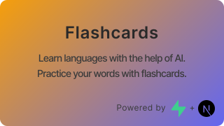

  

A fun way to learn languages. Create collections with cards and utilize the help of AI to generate explanations and translations.

This project was created for the [Supabase Launch Week 7](https://supabase.com/launch-week) hackathon.

Created by: **Roland Kajatin** ([GitHub](https://github.com/Kajatin/supabase-flashcard) & [Twitter](https://twitter.com/rolandkajatin))

---

In this project, I used Supabase as a **database** to store collections and cards with row level security. I also used it for user **authentication**. Users can sign up with their email address and password. Policies protect the database tables from unauthorized access.

<https://github.com/Kajatin/supabase-flashcard/raw/readme/images/demo.mov>
